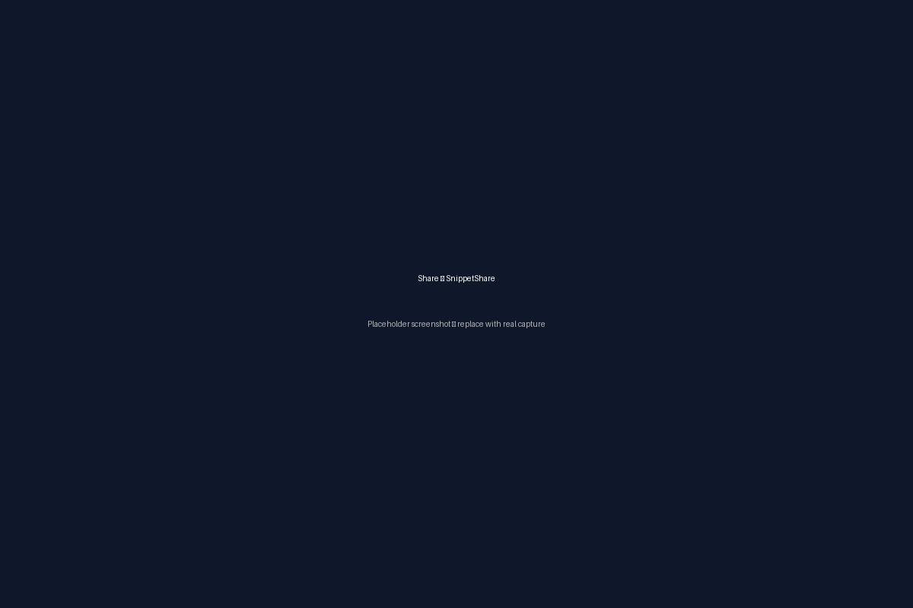

# SnippetShare

A minimal snippet sharing web app (Flask + SQLite) — save, view and share text snippets.

Author / Copyright: Jeevan Rao

---

## Features
- Create, save and share text snippets
- List recent snippets
- Simple REST API: GET /api/snippets, GET /api/snippets/:id, POST /api/snippets
- Single-file Flask backend and static frontend (index.html)
- SQLite database (snippets.db) initialized from `schema.sql`

---

## Screenshots

Add screenshots to the repository at `screenshots/` and they will render here:

- screenshots/home.png — Snippet list / grid
- screenshots/editor.png — Editor / save & share flow
- screenshots/share.png — Example share link view

Example markdown (will render once images are added):




Recommendation: 1200×800 or similar; optimized PNG or compressed JPG.

---

## Local development (macOS)

1. Clone repo and cd into project
2. Create & activate virtualenv (use your preferred Python version)
   - python3 -m venv .venv
   - source .venv/bin/activate
3. Install dependencies
   - pip install -r requirements.txt
4. Initialize database (one-time)
   - export FLASK_APP=app
   - flask --app app init-db

    This will create the `snippets.db` file and set up the necessary table. You only need to do this once.
5. Run dev server
   - python app.py
   - or: FLASK_APP=app FLASK_ENV=development flask run --host=0.0.0.0 --port=8000

Open http://localhost:8000

Notes:
- The repo already contains a CLI helper `flask --app app init-db`.
- If you use the included aliases/venv helpers, adapt activate command accordingly.

---

## Production deployment (suggestions)

Use a production WSGI server (Gunicorn) behind a reverse proxy (nginx).

Example Gunicorn command:
- Install gunicorn: pip install gunicorn
- Run: gunicorn --workers 3 --bind 0.0.0.0:8000 "app:app"

Recommended environment variables:
- SECRET_KEY (override default)
- DATABASE (path to sqlite file; use absolute path for production)

Notes:
- SQLite is simple but not ideal for high-concurrency production. Consider PostgreSQL / MySQL for larger deployments.
- Ensure file permissions on the sqlite DB allow the web server user to read/write.

Optional systemd unit (example):
- Create a service that runs gunicorn and ensure the working directory and virtualenv are set.

Optional Docker (quick example)

Dockerfile (simple):
```dockerfile
FROM python:3.13-slim
WORKDIR /app
COPY . /app
RUN pip install --no-cache-dir -r requirements.txt
ENV FLASK_APP=app
RUN flask --app app init-db
CMD ["gunicorn", "--bind", "0.0.0.0:8000", "app:app"]
```

---

## API

- GET /api/snippets
  - Returns: JSON array of snippets
- GET /api/snippets/<id>
  - Returns: JSON object for snippet or 404
- POST /api/snippets
  - Body: { "content": "your text" }
  - Returns: { "id": <newId>, "message": "Snippet created successfully" }

---

## Security & Notes
- Replace `app.config['SECRET_KEY']` with a secure value in production (use env var).
- Sanitize or limit snippet size if allowing public upload.
- Consider rate-limiting to prevent abuse.

---

If you want, I can:
- Add screenshot placeholders into `screenshots/` for you to replace with real captures
- Add a Docker Compose file or a sample systemd unit